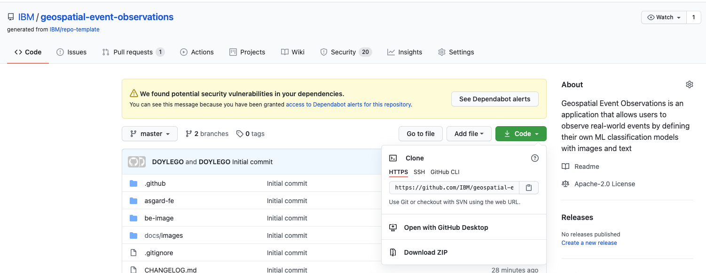

# IBM Geospatial Event Observations

<div align="center">

</div>

## Deployment Instructions

### Deployment Audience

The IBM Geospatial Event Observations application is Dockerized. To complete the deployment instructions the deployer should be familiar with the following Docker concepts:

 - **Building Docker Images:** [Documentation](https://docs.docker.com/engine/reference/commandline/build/)
 - **Running Docker Containers:** [Documentation](https://docs.docker.com/engine/reference/commandline/run/)
 - **(Optional)** Docker Container Port Mapping: [Documentation](https://docs.docker.com/engine/reference/commandline/port/)
 - **(Optional)** Docker Container Volume Mapping: [Documentation](https://docs.docker.com/engine/reference/commandline/volume_create/)

### Deployment Estimates

It is estimated that the IBM Geospatial Event Observations application can be deployed in 30 minutes:

 - **Create a Mapbox Account**: 10 mins
 - **Retrieving Files:** 5 mins
 - **Building the Docker Image:** 5 mins
 - **Running the Docker Container:** 5 mins
 - **Validation:** 15 mins

### Create a Mapbox Account

The Geospatial Event Observations application uses [Mapbox](https://www.mapbox.com/) as the map provider for the Map-based User Interface. To use the Map-based User Interface you will need to create a Mapbox account and generate an API key through the following process:

1. [Sign-up](https://account.mapbox.com/auth/signup/) for a Mapbox account. There is a free tier that can be used to test Geospatial Event Observations.
2. Once your account is created you can manage [Access Tokens](https://account.mapbox.com/access-tokens/). An Access Token is needed for use with the Map-based User Interface for Geospatial Event Observations.

### Retrieve the Application Files

Create a directory for the application on your local system and copy the files from this GitHub repository using one of the following methods:

1. Git Clone

`cd <TARGET_DIR>`

SSH:

`git clone git@github.com:IBM/geospatial-event-observations.git`

HTTPS:

`git clone https://github.com/IBM/geospatial-event-observations.git`

2. Download Archive

Download and extract an archive of the repository files from the [GitHub Repository page](https://github.com/IBM/geospatial-event-observations).

<div align="center">

</div>

### Build the docker image

Run the following commands to build the docker image for the IBM Geospatial Event Observations application:

`docker build -t <IMAGE_NAME>:<TAG> <TARGET_DIR>`

Replace the following:
* `<IMAGE_NAME>`: The name of the IBM Geospatial Event Observations docker image e.g. geospatial-event-observations
* `<TAG>`: A tag name for this version of the docker image e.g. latest
* `<TARGET_DIR>`: The path to the [Dockerfile](be-image/Dockerfile) at the root of the be-image

### Running the docker image

The IBM Geospatial Event Observations docker image can be run from docker.

#### Docker

Run the following docker command once the docker image is built:

`docker run -d -p <EXT_PORT>:5000 -v <EXT_TARGET_DIR>:/event-data:rw <IMAGE_NAME>:<TAG>`

Replace the following:
* `<EXT_PORT>`: The host port to map to the docker container port e.g. 5000 (app would be available at http://localhost:5000)
* `<EXT_TARGET_DIR>`: A Directory on the host used to create a Docker Volume for persistent storage e.g. /home/IBM-Geospatial-Event-Observations/event-data 
* `<IMAGE_NAME>`: The name of the IBM Geospatial Event Observations docker image e.g. geospatial-event-observations
* `<TAG>`: A tag name for this version of the docker image e.g. latest

## Validation Instructions

To validate that the application is running correctly open a web browser and point it to http://localhost:5000/map-ui/index.html

* You should see the application home page with a request to enter your Mapbox Access Token:

<div align="center">

</div>

* The IBM Geospatial Event Observations Open API / Swagger page can be found at http://localhost:5000

<div align="center">

</div>

## Configure the Mapbox API Key

To store the Mabox Access Token created previously in the application instance perform the following steps:

1. Expand the Geospatial Event Observations menu by clicking on the globe icon.

<div align="center">

</div>

2. Open the Settings menu by clicking the `cog` icon at the bottom of the menu. Change to the Mapbox Key tab.

<div align="center">

</div>

3. Enter the Mapbox Access Token from your Mapbox account into the `Key` text field. 

<div align="center">

</div>

4. Save the Mapbox Key by clicking the `Save` button. Once the Mapbox Key is saved the Mapbox map should populate in the background.

<div align="center">

</div>

5. The Geospatial Event Observations application is now ready to use.

<div align="center">

</div>

## Next Steps

For more information on using Geospatial Event Observations continue to the [User Guide](docs/README_User_Guide.md).

# Acknowledgements

This project received funding as part of the ASGARD project under the EC Horizon 2020 FCT-2015 research and innovation programme.

Grant Agreement No. 700381

# Authors

- Gordon Doyle <doylego@ie.ibm.com>
- Gabriele Ranco
- Jason Lloyd

# License

```text
Copyright 2020 IBM, Inc and contributors. All rights reserved.

Licensed under the Apache License, Version 2.0 (the "License");
you may not use this file except in compliance with the License.
You may obtain a copy of the License at

http://www.apache.org/licenses/LICENSE-2.0

Unless required by applicable law or agreed to in writing, software distributed under the License is distributed on an "AS IS" BASIS, WITHOUT WARRANTIES OR CONDITIONS OF ANY KIND, either express or implied. See the License for the specific language governing permissions and limitations under the License.

=================================================
Creative Commons License
=================================================

This distribution uses the following components which are licensed under a Creative Commons License (https://creativecommons.org/licenses/)

font-awesome (5.11.2) licensed under CC BY 4.0 + MIT-equivalent + OFL 1.1  https://github.com/FortAwesome/Font-Awesome
License available at https://creativecommons.org/licenses/by/4.0/

=================================================
BSD 3-Clause License
=================================================

This distribution uses the following components which are licensed under a BSD 3-Clause License (https://opensource.org/licenses/BSD-3-Clause)

ipython (7.12.0) Licensed under BSD 3-Clause https://github.com/ipython/ipython
License available at https://github.com/ipython/ipython/blob/master/LICENSE

scikit-learn (0.21.2) Licensed under BSD 3-Clause https://github.com/scikit-learn/scikit-learn
License available at https://github.com/scikit-learn/scikit-learn/blob/master/COPYING
```