# IBM Geospatial Event Observations User Guide

**This README explains how to use Geospatial Event Observations: data preparation, UI functions, API functions etc. For information about how to build and deploy the application, see the [README](../README.md). For additional technical details, see the [Technical Guide](README_Technical_Guide.md).**

## Table of Contents

* [Data Preparation](#data-preparation)
* [Map UI Usage](#map-ui-usage)
* [Open API Usage](#open-api-usage)
* [Technical Details](#technical-details)


## Data Preparation

The Geospatial Event Observations application requires two sets of data - Training Data, used to train the machine learning models that perform the event detection, and Input Data that is analysed by the Machine Learning models for occurances of events defined by the training data. Both of these data sets are file and directory structure based. The following sections describe the formats required for the Training Data and the Input Data.

### Training Data

<div align="center">
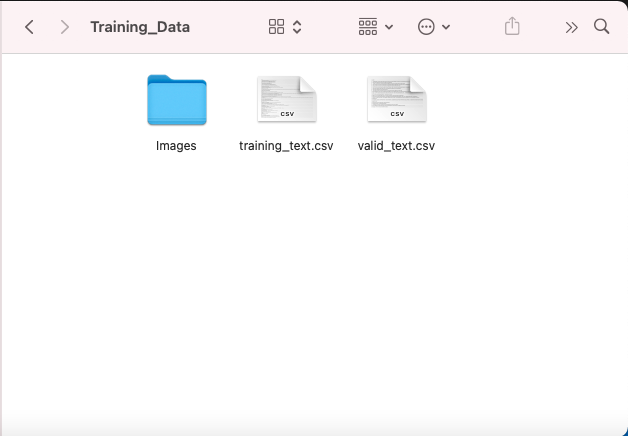
</div>


The Geospatial Event Observations application analyses short text (e.g. social media posts, SMS messages etc.) for occurances of a user-defined event. The Training Data required for short text to define this event has the following format:

* **training_text.csv**: a CSV file containing examples of short, natural language text that would constitute an occurance of the target event. The CSV file should have the following format:

| Column Number | Column Name | Description |
| ------ | ------ | ------ | 
| 01 | ID | A numeric identification number used to track this example short text |
| 02 | TEXT | An example of short, natural language text that would constitute an occurance of the target event |
| 03 | TOPIC | A keyword classification for the event type e.g. riot, arson etc. |

* **valid_text.csv**: a CSV file containing examples of short, natural language text that would constitute an occurance of the target event. This CSV file is used to validate the correct operation of the Machine Learning model after it is generated in the training step. The CSV file should have the following format: 

| Column Number | Column Name | Description |
| ------ | ------ | ------ | 
| 01 | ID | A numeric identification number used to track this example short text |
| 02 | TEXT | An example of short, natural language text that would constitute an occurance of the target event |
| 03 | TOPIC | A keyword classification for the event type e.g. riot, arson etc. |

The Geospatial Event Observations application analyses images for occurances of a user-defined event. The Training Data required for images to define this event has the following format:

* **Images**: a directory that follows the Keras image processing format. The Images directory contains three sub-directories called `train`, `valid` and `test`. Each of the three sub-directories contains another sub-directory that is named as the TOPIC or classification of the event. The `train` TOPIC sub-directory contains the majority of example images that define the event. The `valid` and `test` TOPIC sub-directories should contain smaller sets of images that define the event. These are used for validation of the Machine Learning model once it is trained. The Images directory structure is therefore:

```
- Images (directory)
        - train (directory)
            - <TOPIC> (directory)
                - <IMAGE_FILE>
                    .
                    .
                    .
                - <IMAGE_FILE>
        - valid (directory)
            - <TOPIC> (directory)
                - <IMAGE_FILE>
                    .
                    .
                    .
                - <IMAGE_FILE>
        - test (directory)
            - <TOPIC> (directory)
                - <IMAGE_FILE>
                    .
                    .
                    .
                - <IMAGE_FILE>
```

Where:
* `<TOPIC>`: is a short descripitve string classification for the event.
* `<IMAGE_FILE>`: an image file depicting an occurance of the target event.

The image file formats supported are:

| Name | File Type |
| ------ | ------ |
| PNG | .png |
| JPEG | .jpg, .jpeg |
| Bitmap | .bmp |
| PPM | .ppm |
| TIFF | .tif, .tiff |

<div align="center">
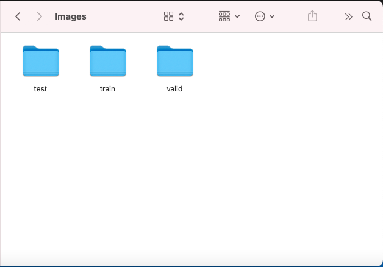
</div>


The format of the Training Data directory structure (both text and images) is therefore:

```
 - Training_Data (top-level directory)
    - training_text.csv
    - valid_text.csv
    - Images (directory)
        - train (directory)
            - <TOPIC> (directory)
                - <IMAGE_FILE>
                    .
                    .
                    .
                - <IMAGE_FILE>
        - valid (directory)
            - <TOPIC> (directory)
                - <IMAGE_FILE>
                    .
                    .
                    .
                - <IMAGE_FILE>
        - test (directory)
            - <TOPIC> (directory)
                - <IMAGE_FILE>
                    .
                    .
                    .
                - <IMAGE_FILE>
```


<div align="center">
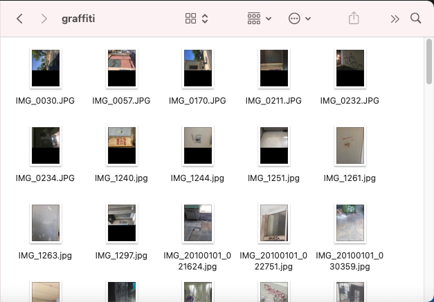
</div>


### Input Data

The Geospatial Event Observations application analyses input short, natural language text and images for occurances of the event defined by the Training Data. The Input Data is also a directory structure and should have the following format:

* **Input CSV file**: a CSV file containing short, natural language text pieces to be analysed, with associated GPS & Datetime and related images if available. The input CSV file should have the following format:

| Column Number | Column Name | Description |
| ------ | ------ | ------ |
| 01 | ID | The row number as it was in the Input Data |
| 02 | TEXT | The original piece of short text as it was in the Input Data |
| 03 | IMAGE | The filename of the image from the Input Data |
| 04 | LAT | The GPS Latitude coordinate for this text, image, or both |
| 05 | LONG | the GPS Longitude coordinate for this text, image or both |
| 06 | date | the date and time asscoiated with the text, image or both |

* **Images**: a directory containing a set of images to be analysed. The directory should have the following structure:

```
- Images (directory)
    - <IMAGE_FILE>
        .
        .
        .
    - <IMAGE_FILE>
```

Where:
* `<IMAGE_FILE>`: an image file to be analysed.

The image file formats supported are:

| Name | File Type |
| ------ | ------ |
| PNG | .png |
| JPEG | .jpg, .jpeg |
| Bitmap | .bmp |
| PPM | .ppm |
| TIFF | .tif, .tiff |

The format of the Input Data directory structure (both text and images) is therefore:

```
 - Input_Data (top-level directory)
    - input.csv
    - Images (directory)
        - <IMAGE_FILE>
            .
            .
            .
        - <IMAGE_FILE>
```


<div align="center">
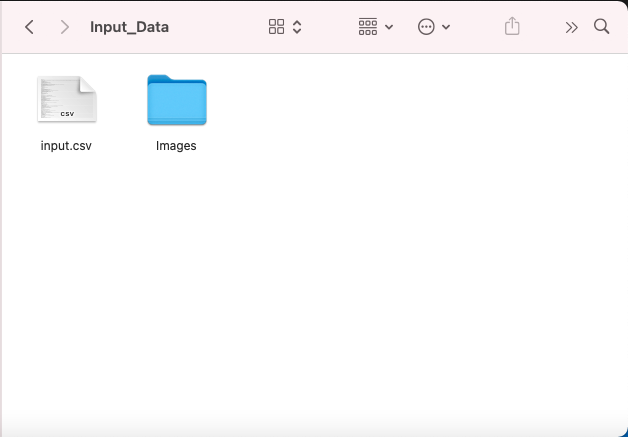
</div>


## Map UI usage

The main User Interface for the Geospatial Event Observations application is delivered as a Map-based interface with overlay dialogs to manage locations, ML classification models, data to be analysed and detected events in the system. The Map-based UI can be found at `http://localhost:5000/map-ui/index.html`.

### Location Switching

The Location Switching dialog is accessed from the location button pinned to the top of the map view. Moving between geographic locations to a specific zoom factor can be done more quickly by using this dialog. This can be important if monitoring several regions is required.

<div align="center">
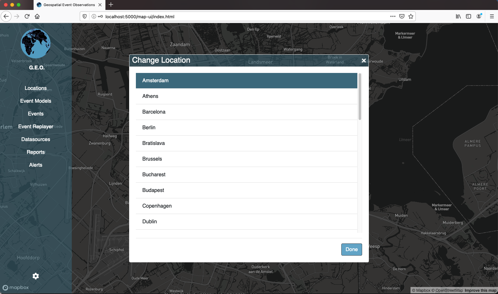
</div>


### Location Management

Right-clicking on the map will cause a popup to be displayed underneath the location button pinned to the top of the map view. This popup displays the GPS co-ordinates and current zoom factor for the selected location. The Location Management dialog can be opened from the `Save` icon here. Location co-ordinates and zoom factor will be pre-populated in the dialog and the new location can be saved by entering a name. Saved locations will become available in the Location Switching dialog. Locations can be updated and deleted from the Location Management dialog.

<div align="center">
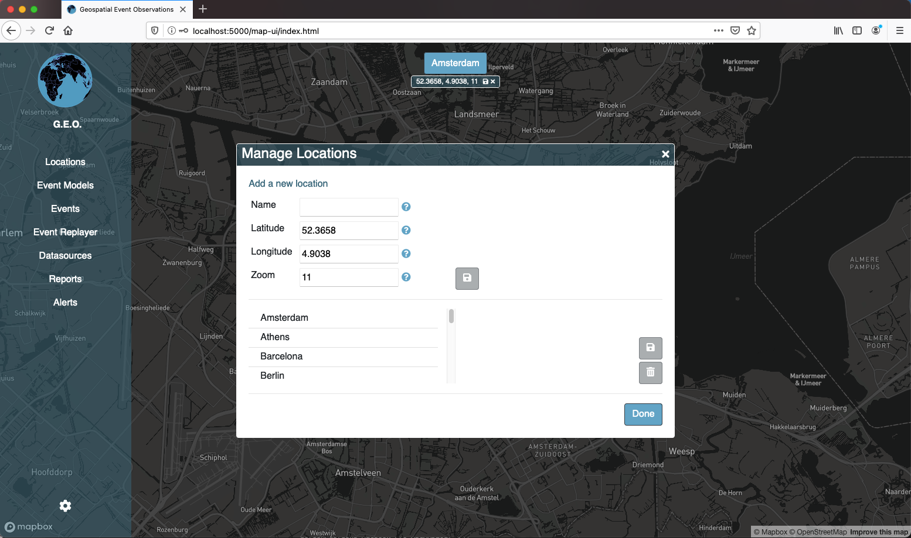
</div>


### Event Model Management

Machine Learning classification models are used to detect instances of events within input data. The ML classification model uses the Training Data described in the [Data Preparation](#data-preparation) section to define the event. This data is combined with a base, pre-built categorical classification model to build a model that specifically detects instances of the target event. To build a model, the user must enter the following on the Create an Event Model tab of the Event Model Management dialog:

1. **Name**: a short text identifier for the target event.
2. **Training Data**: a zip archive of the training data.
3. **Severity**: a tier/level that indicates how important/urgent the event category is - used to draw attention when displyed on the map.
4. **Icon**: an icon image used as a short-hand visual representation of the event type when instances are marked on the map.


<div align="center">
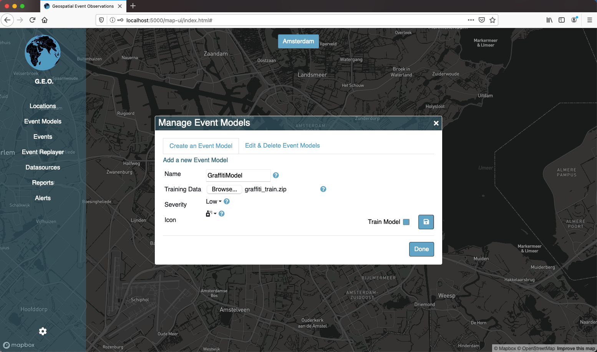
</div>


The new Event Model can be saved and optionally trained immmediately. The training process is done in the background and depending on the amount of training data can take a long time. The Edit & Delete Event Models tab shows the current status of Event Models created in the system. The icon beside the Event Model indicates:

1. **Train Icon**: the Event Model was created but still needs to be trained.
2. **Spinner Arrows**: the Event Model is in the process of being trained. Training can be cancelled using the cancel button.
3. **Certificate Icon**: the Event Model has been trained and is available to apply to input data to detect instances of the event.


<div align="center">
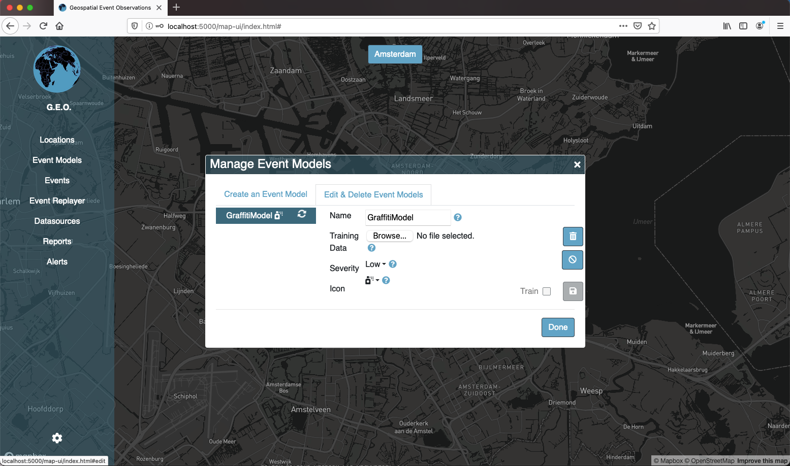
</div>


Event Models can be managed here also - properties of an Event Model can be updated, including updating the Training Data for the Event Models. Event Models whose training data has been updated can be re-trained. Event Models can be deleted from here when they are no longer needed.

### Datasource Management

The user can add data to be analysed to the system through the Create a Datasource tab of the Manage Datasources dialog. The user provides Input Data, as described in the [Data Preparation](#data-preparation) section of this User Guide. This data is represented as a Datasource in the application and has the following properties:

1. **Name**: a short, text identifier to describe the datasource.
2. **Type**: the datasource type indicates how the data will be accessed when analysed. Currently only the File type is functional.
3. **File**: an file upload input to submit the zip archive containing the Input Data.


<div align="center">
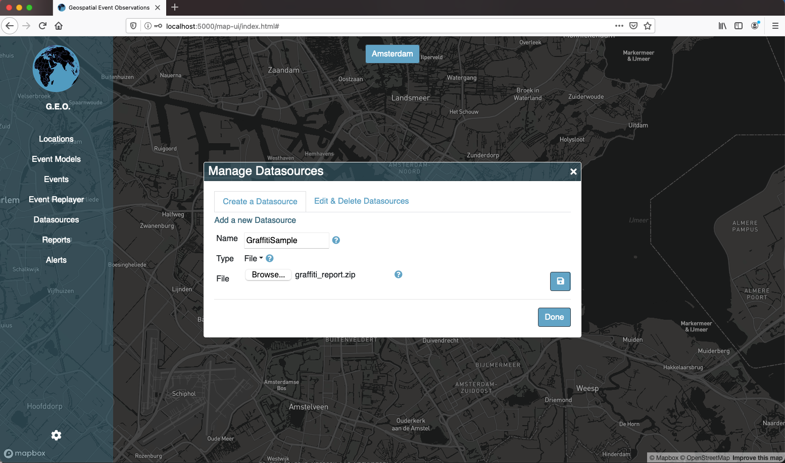
</div>


Datasources can be managed from the Edit & Delete Datasources tab of the Manage Datasources dialog. Selecting an available datasource from the list will populate the dialog area with Datasource Details and Models & Filters tabs. Datasources can be updated and deleted from the Datasource Details tab. Existing Event Models can be applied to the datasource from the Models & Filters tab. Any detected instances of the Event type within the Datasource will be displayed with an icon at the co-ordinates associated with the input data element on the map.


<div align="center">
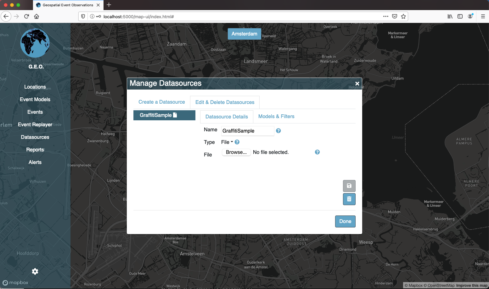
</div>


### Events

Detected instances of an Event type are displayed as an icon on the map at the co-ordinates associated with the input data element. The icon is highlighted by a circular border that pulses. The Severity property associated with the Event type controls how fast the border pulses. Higher Severity Events pulse faster to attract attention. The icon can be clicked to popup a details card showing relevant text and a thumbnail image (if any). The popup card links to the Events dialog. The Events dialog shows more information associated with the detected event instance:

* **Date & Time**: the date and time associated with the detected event instance.
* **Location**: the GPS co-ordinates for the detected event instance.
* **Image**: if an image was associated with the detected event instance it can be clicked on to show an enlarged view.
* **Text**: the short text associated with the detected event instance. This can give more context to why the input data was classified as an instance of the Event type.
* **Score**: the probability score associated with the detected event instance. This gives an indication as to the confidence the Event Model had in classifying this input data element as an instance of the Event type.


<div align="center">
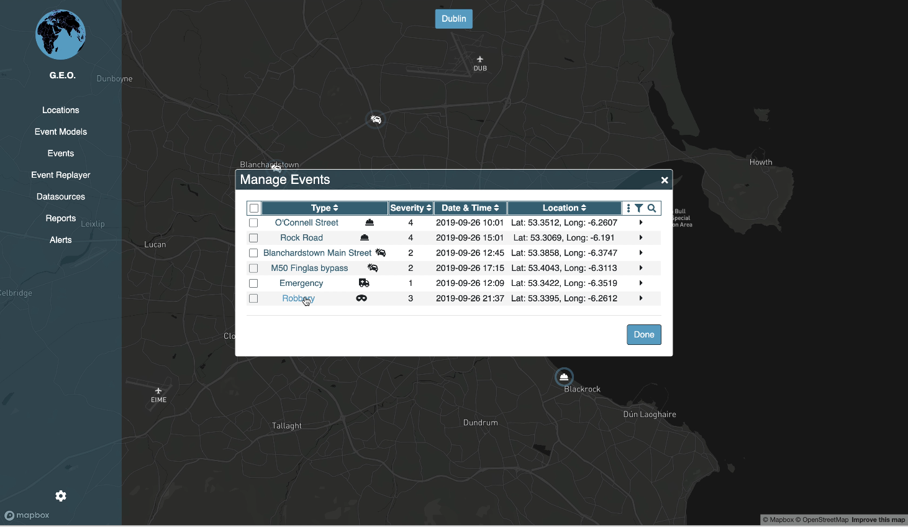
</div>


### Settings

The Application Settings dialog provides control options for the application. The Application Settings tab allows the user to relaod the default pre-defined locations and icons. If these controls are used any user-defined locations or icons will be removed from the system. Diagnostics can also be turned on and off - this setting controls the amount of information that will be shown in the application logs. The Default Location tab allows the user to set a default location to open at when the Map-based UI is accessed. The Map Marker Icons tab provides a dialog to manage icons within the application. Icons can be added from Font Awesome or the user can upload their own icon image files (max 64x64 pixels).


<div align="center">
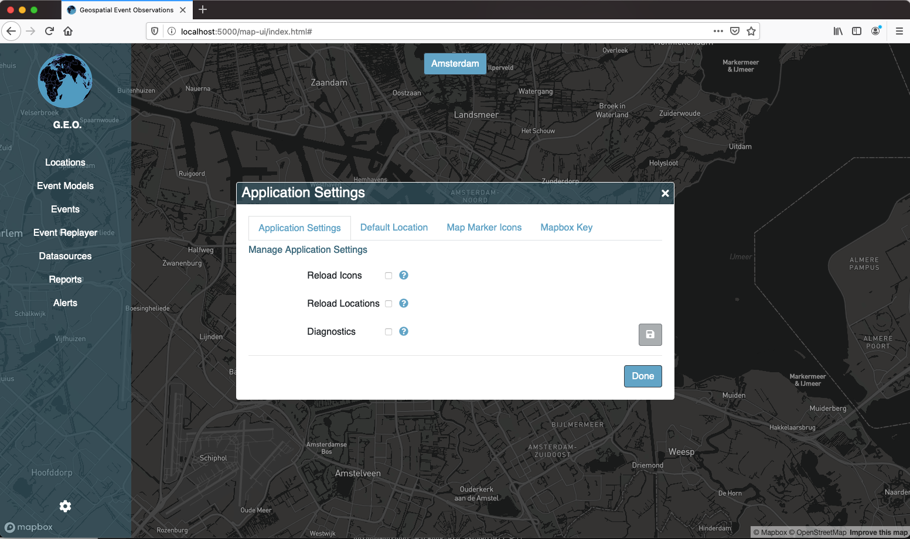
</div>


## Open API usage

The Geospatial Event Observations application uses the Open API (Swagger) standard for documenting its ReST API. The functions of the application can all be accessed programmatically via the functions described in this Open API page. The HTTP request methods available for each function are listed and can be interacted with through the built in request mechanisms.

<div align="center">
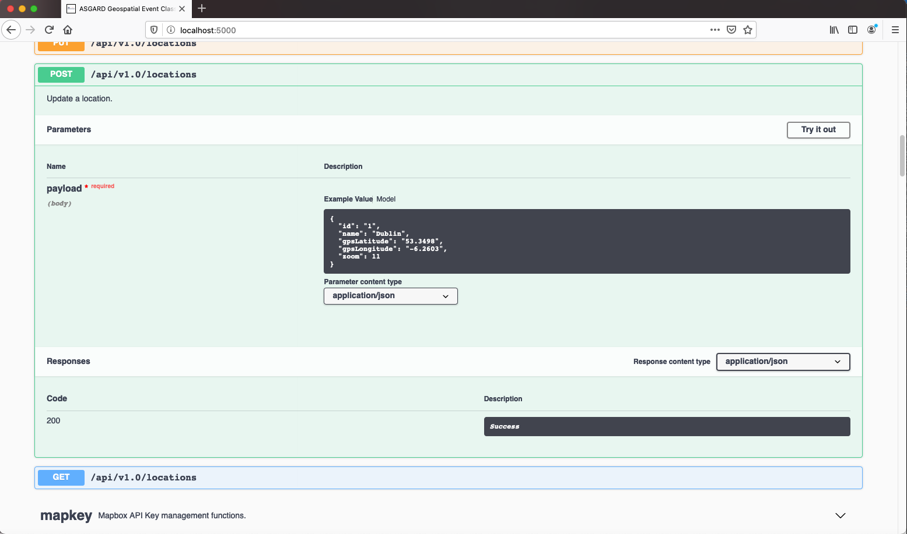
</div>


More details on the parameters that each function accepts are given in the Models section at the end of the page.


<div align="center">
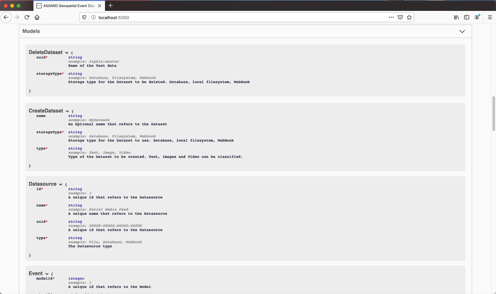
</div>

## Technical Details

Additional Technical Details can be found in the [Technical Guide](README_Technical_Guide.md).